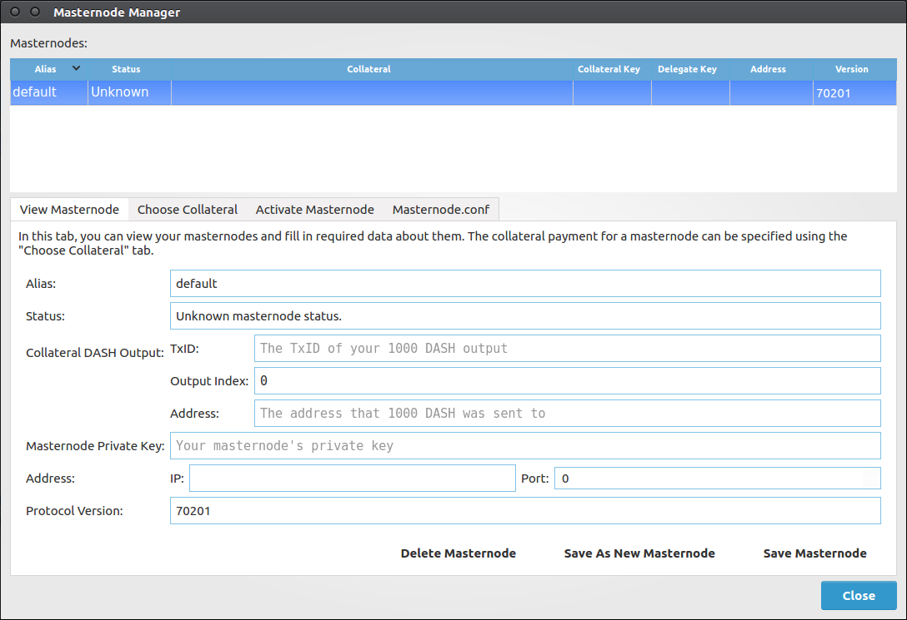
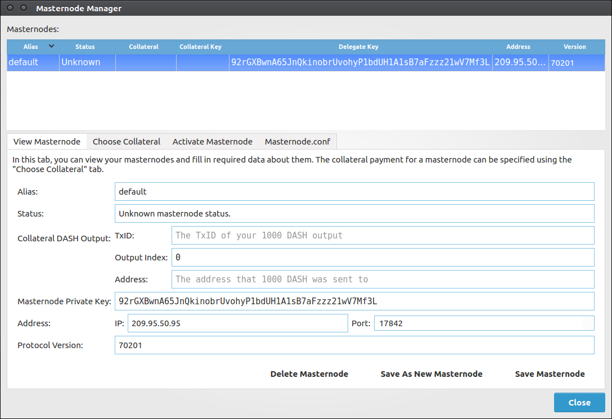
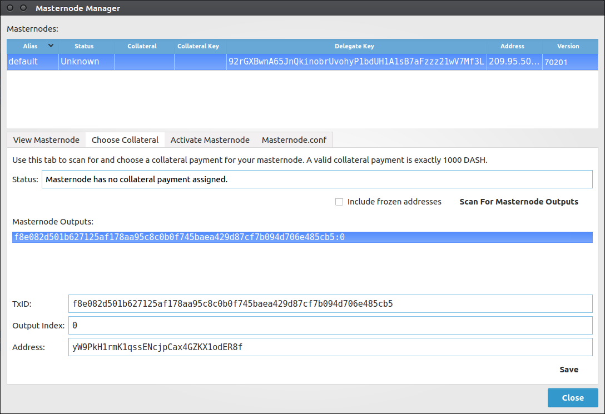
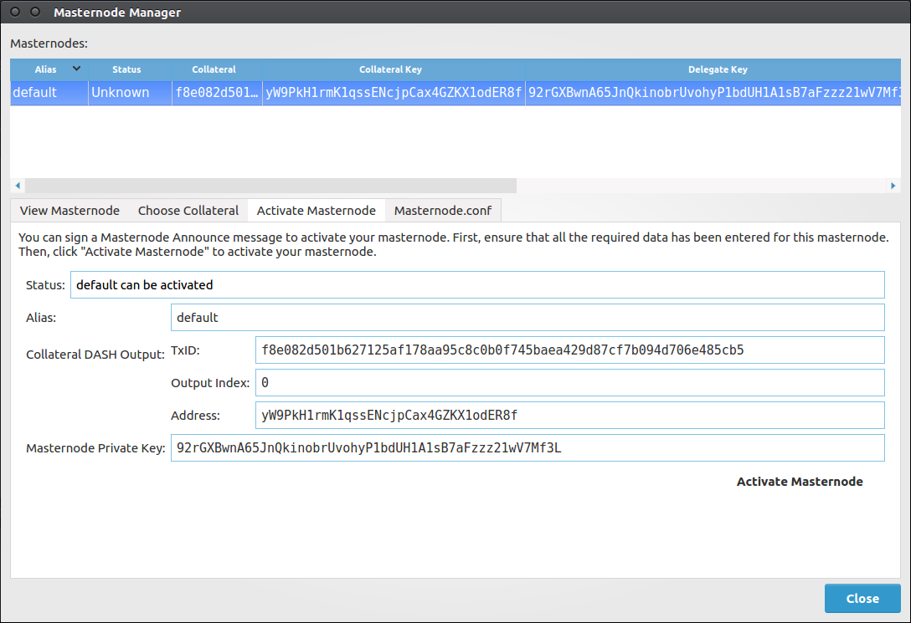

# Masternodes

Electrum-DASH supports masternode creation through an interface called the Masternode Manager.

## Masternode Manager

The Masternode Manager can be accessed either by using the menu (`Wallet` > `Masternodes`) or
by pressing `Ctrl+M`.

This manager displays the status of your masternode(s). A wallet with no masternodes will begin
with a default masternode that you can fill in the information for.

The manager displays the following data about each masternode you have set up:

- The alias (name) of the masternode.
- The status of the masternode (e.g. whether it has been activated).
- The collateral payment of the masternode.
- The private delegate key.
- The IP address and port that your masternode can be reached at.
- The protocol version that your masternode supports.

## Setting Up

**The screenshots below are of Dash's testnet.**

### Delegate Key

A masternode requires a "delegate" key, which is known to both Electrum-DASH and your masternode.
Your masternode will use this key to sign messages, and the DASH network will know that you authorized
it to.

A delegate key can either be one of your Electrum-DASH keys, or an imported key. Either way, your masternode
and Electrum-DASH will both need to know the private key. (See *Importing Masternode.conf* below.)

To use one of your Electrum-DASH keys as a delegate key, put its private key in the `Masternode Private Key`
field of the `View Masternode` tab.

### IP Address and Protocol Version

Certain information about your masternode is required. The IP address and port that your masternode uses
must be supplied. Also, the protocol version that your masternode supports is required. This information is filled
in automatically if you import a "masternode.conf" file.

### Collateral (1000 DASH Payment)

To start a masternode, you must have a 1000 DASH payment available in your wallet.
You can scan your wallet for 1000 DASH payments in the `Choose Collateral` tab of the Masternode
Manager.

After scanning, a list of available 1000 DASH collateral payments will be displayed. Selecting one
of them will cause the selected masternode's data to be filled in, though these changes won't be saved
until you click the `Save` button in the lower-right corner of the tab.

### Activating Your Masternode

After selecting a collateral payment and specifying a delegate key, you can activate your masternode.
Do this by clicking `Activate Masternode` in the `Activate Masternode` tab of the Masternode Manager.

If the `Activate Masternode` button cannot be clicked, look at the message in the `Status:` bar. It
will show you why your masternode cannot be activated.

Activation will require your password if your wallet is encrypted, because a message must be signed. After
waiting for Electrum-DASH to sign and broadcast your masternode announcement, you will be presented with
a message detailing the result.

The status of your masternode will be updated in the table and the `View Masternode` tab.

## Importing Masternode.conf

You can import a "masternode.conf" file using the `Masternode.conf` tab of the Masternode Manager.
This is the recommended way of setting up masternodes, as it allows you to configure masternodes for
dashd and Electrum-DASH in the same way.

Importing a "masternode.conf" file will automatically set up one or more masternode configurations in
the Masternode Manager.
